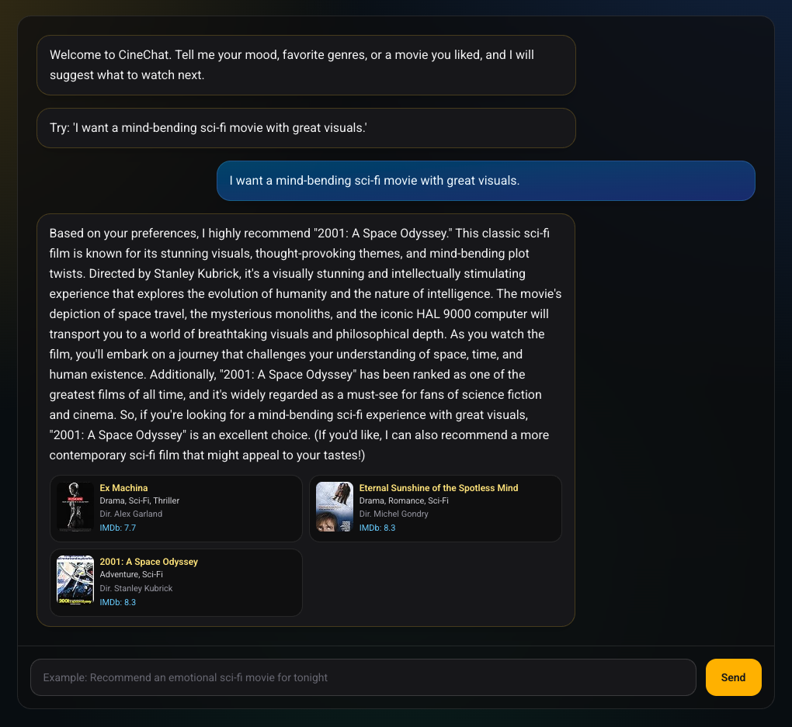

# Movie Chatbot

AI-powered movie recommendation chat application built with a Next.js frontend and a NestJS backend.



## Overview

This monorepo contains two apps:

- `movie-ai-frontend`: single-page chat UI where users ask for movie suggestions
- `movie-ai-backend`: AI API that retrieves similar movies and generates recommendations

The backend combines:

- local embeddings via Hugging Face transformers
- vector similarity search with Pinecone
- natural language response generation with Groq (Llama)

## Repository Structure

```text
.
├── Readme.md
├── cleaned_imdb_data.csv
├── data_preprocessing.ipynb
├── readme_assets/
│   └── main.png
├── movie-ai-backend/
│   ├── src/
│   │   └── movie/
│   │       ├── movie.controller.ts
│   │       └── movie.service.ts
│   └── package.json
└── movie-ai-frontend/
		├── app/
		│   ├── layout.tsx
		│   └── page.tsx
		└── package.json
```

## Tech Stack

### Frontend

- Next.js 16 (App Router)
- React 19
- Tailwind CSS 4

### Backend

- NestJS 11
- @huggingface/transformers
- @pinecone-database/pinecone
- groq-sdk

## How It Works

1. User sends a chat message from the frontend.
2. Frontend calls `POST /movie/chat` on the backend.
3. Backend creates an embedding for the message.
4. Backend queries Pinecone for similar movie entries.
5. Backend sends matched context to Groq LLM.
6. Backend returns:
   - `message`: natural language recommendation
   - `sourceData`: matched movie metadata (title, genre, poster, rating, etc.)
7. Frontend renders the assistant message and source movie cards.

## Prerequisites

- Node.js 20+
- pnpm 9+
- Pinecone account + index named `movie-chatbot`
- Groq API key

## Environment Variables

### Backend (`movie-ai-backend/.env`)

```bash
PINECONE_API_KEY=your_pinecone_api_key
GROQ_API_KEY=your_groq_api_key
PORT=3000
```

### Frontend (`movie-ai-frontend/.env.local`)

```bash
NEXT_PUBLIC_MOVIE_API_URL=http://localhost:3000
```

## Local Development

Install and run each app in separate terminals.

### 1) Start backend

```bash
cd movie-ai-backend
pnpm install
pnpm run start:dev
```

Backend default URL: `http://localhost:3000`

### 2) Start frontend

```bash
cd movie-ai-frontend
pnpm install
pnpm run dev
```

Frontend default URL: `http://localhost:3001` or the next available port shown by Next.js.